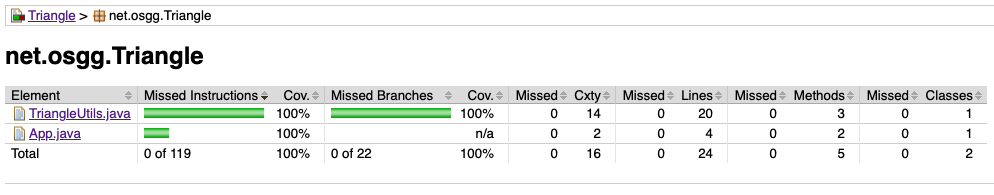
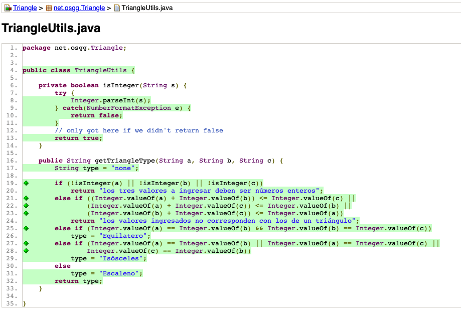

# JAVA - CONTRUCCION DE SOFTWARE
## Java Code Coverage (JACOCO) example for the classic Triangle Program

Actividad 22. Herramientas para pruebas unitarias
Actividad individual.

- Genera casos de prueba necesarios para cubrir el 100% de decisiones-condiciones del código clonado (descargar código de github).
- Ejecuta los casos de prueba.
- Compara las salidas observadas con respecto a las esperadas.

Genera los casos de prueba necesarios para lograr el 100% de cobertura de decisiones-condiciones (usando jacoco).

Sube el proyecto a la plataforma virtual .

| TEST COVERAGE|
| :-: |
|  |

| CODE|
| :-: |
|  |
